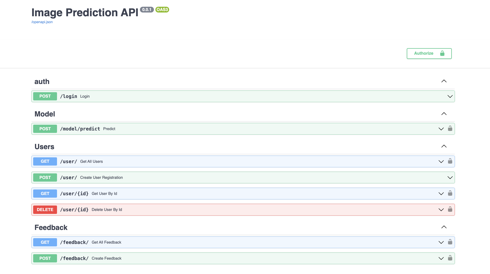
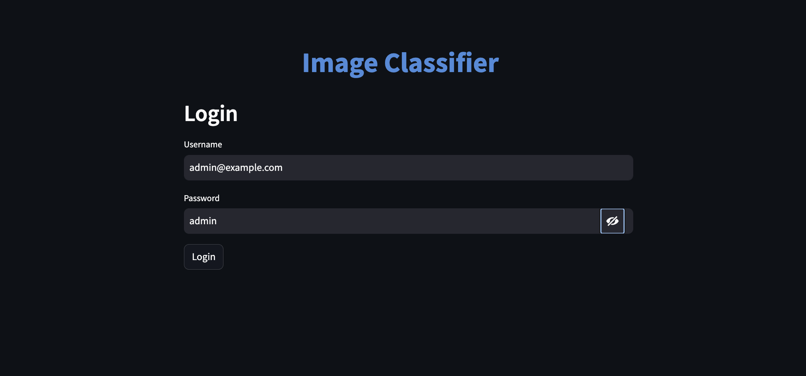
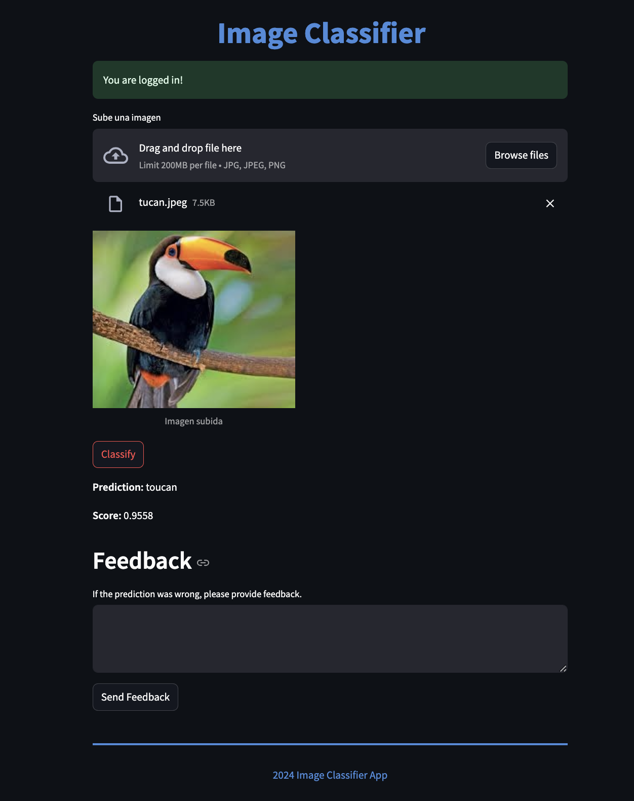

# NYC Taxi Fare and Trip Duration Prediction

> A FastAPI-based Machine Learning application for predicting taxi fares and trip durations in New York City

## Project Overview

This project implements a machine learning solution to predict taxi fares and trip durations in New York City using data available at the start of the ride. The system uses a combination of supervised learning models and neural networks to make accurate predictions based on features like pickup/dropoff coordinates, trip distance, start time, passenger count, and rate code.

The application provides both a REST API for integration with other systems and a web interface for easy interaction by end users.

## Key Features

- Real-time prediction of taxi fares and trip durations
- Exploratory data analysis to identify key factors affecting ride costs and times
- Heatmap visualization of taxi demand across different NYC regions
- Secure API with proper authentication and rate limiting
- Comprehensive documentation for all endpoints

## Technical Architecture

The application is built using a microservices architecture with the following components:

- **Python FastAPI**: Core backend service that handles prediction requests
- **Machine Learning Pipeline**: Preprocesses data and serves predictions using TensorFlow and scikit-learn
- **Web UI**: Interactive interface for users to input trip parameters and view predictions
- **Redis**: Message broker for communication between services
- **PostgreSQL**: Database for storing trip data and user feedback
- **Docker**: Containerization for easy deployment and scalability

## Getting Started

### Prerequisites

- Docker and docker-compose
- Git
- (Optional) Linux subsystem for Windows (WSL2)

### Installation

1. Clone the repository:

```bash
git clone https://github.com/yourusername/nyc-taxi-prediction.git
cd nyc-taxi-prediction
```

2. Set up environment variables:

```bash
cp .env.original .env
```

3. Create the shared Docker network:

```bash
docker network create shared_network
```

4. Start the services:

```bash
docker-compose up --build -d
```

5. Populate the database:

```bash
cd api
cp .env.original .env
docker-compose up --build -d
```

### Note for Mac M1 Users

This project includes specific optimizations for Mac M1 architecture:

- Use the provided `Dockerfile.M1` in the model directory which uses a compatible Python version
- The Dockerfile uses condaforge/miniforge3 with Python 3.8 to ensure compatibility with TensorFlow and numpy

## Accessing the Application

### API Documentation

The FastAPI documentation is available at: http://localhost:8000/docs

To authenticate:

- Username: admin@example.com
- Password: admin



### Web Interface

The web UI is accessible at: http://localhost:9090




Login credentials:

- Username: admin@example.com
- Password: admin

## Development and Testing

### Code Style

This project follows strict code style guidelines. To format code:

```bash
isort --profile=black . && black --line-length 88 .
```

### Running Tests

The project includes comprehensive tests for all modules:

#### API Tests

```bash
cd api/
docker build -t fastapi_test --progress=plain --target test .
```

#### Model Tests

```bash
cd model/
docker build -t model_test --progress=plain --target test .
```

#### UI Tests

```bash
cd ui/
docker build -t ui_test --progress=plain --target test .
```

#### End-to-End Integration Tests

Install testing requirements:

```bash
pip3 install -r tests/requirements.txt
```

Run the integration tests:

```bash
python tests/test_integration.py
```

## Project Structure

```
├── api/                # FastAPI backend service
├── model/              # ML models and prediction logic
├── ui/                 # Web user interface
├── tests/              # Integration tests
├── uploads/            # Shared volume for uploaded data
└── docker-compose.yml  # Service orchestration
```

## Future Improvements

- Integration with real-time traffic data
- Addition of weather condition factors to improve predictions
- Geographic expansion to other major cities
- Mobile application for on-the-go predictions

## License

This project is licensed under the MIT License - see the LICENSE file for details.
